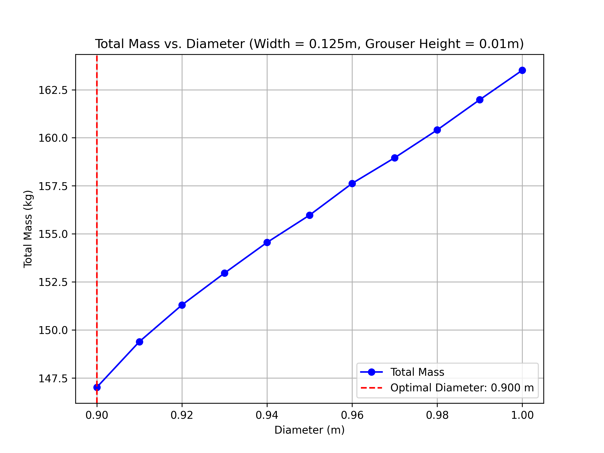
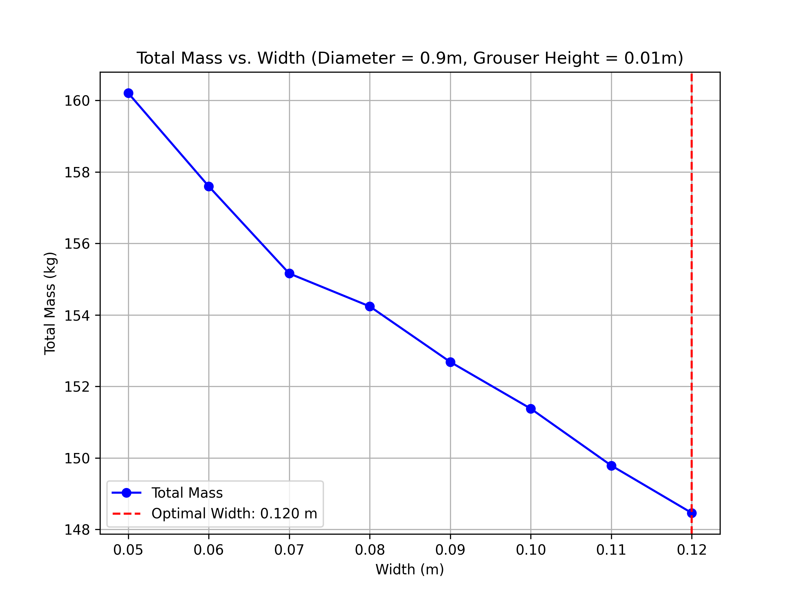
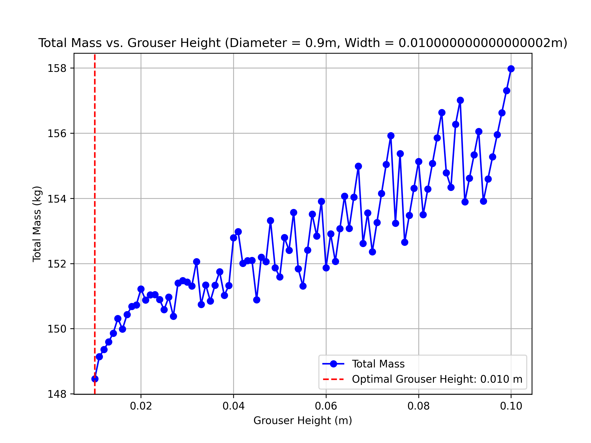

# SCORPION Wheels

## Sources
1. [ENAE 788X - Terramechanics 1](https://spacecraft.ssl.umd.edu/academics/788XF24/788XF24L07.terramechanics1.pdf)

2. [ENAE 788X - Terramechanics 2](https://spacecraft.ssl.umd.edu/academics/788XF24/788XF24L08.terramechanics2.pdf)

3. matweb

4. [ENES100 Torque Calcs for a Motor](https://docs.google.com/spreadsheets/d/1mCtk_9g7qNtW8Typv6NiZEl2GAhqOmPYvU3oydtt6Oc/edit?usp=sharing)

5. [NASA Terramechanics White Paper](https://ntrs.nasa.gov/api/citations/20220010732/downloads/Terramechanics_white_paper.pdf)

6. [A Grouser Spacing Equation for Determining Appropriate Geometry of Planetary Rover Wheels](https://www.ri.cmu.edu/pub_files/2012/10/SkoniecznyIROS2012.pdf)

7. [Parametric Study and Design Guidelines for Rigid Wheels for Planetary Rovers](https://www.researchgate.net/publication/336185520_Parametric_study_and_design_guidelines_for_rigid_wheels_for_planetary_rovers)

8. [Development and experimental validation of an improved pressure-sinkage model for small-wheeled vehicles on dilative, deformable terrain](https://www.sciencedirect.com/science/article/abs/pii/S002248981300092X)

## Notes

### Source 7

- Sutoh et al. (2013) proposed a grouser design method based on observations of wheel travel speed for various grouser count and height.
- Section 3.2/3.3: Grouser hieght seems to have more of an impact than grouser count. This is likely because of small sample size and the 12 count at 15mm grousers being plenty already when compared to 24
- Readers can find more observation data and detailed analysis not only for small ridged wheels but also for compliant wheel and larger diameter wheel in (Moreland (2013)).
- This is because required minimum grouser count reduces at higher slip while a wheel can generally achieve high tractive efficiency at slip ratio of around 0.1-0.3.
- Grouser chevron angle doesn't seem worth it

- Test to get a sinkage slip relation for the size of wheel we have??? - Some analytical studies of slip-sinkage relationship and its simple modeling can be found in (Lyasko (2010)).

## Size Selection

